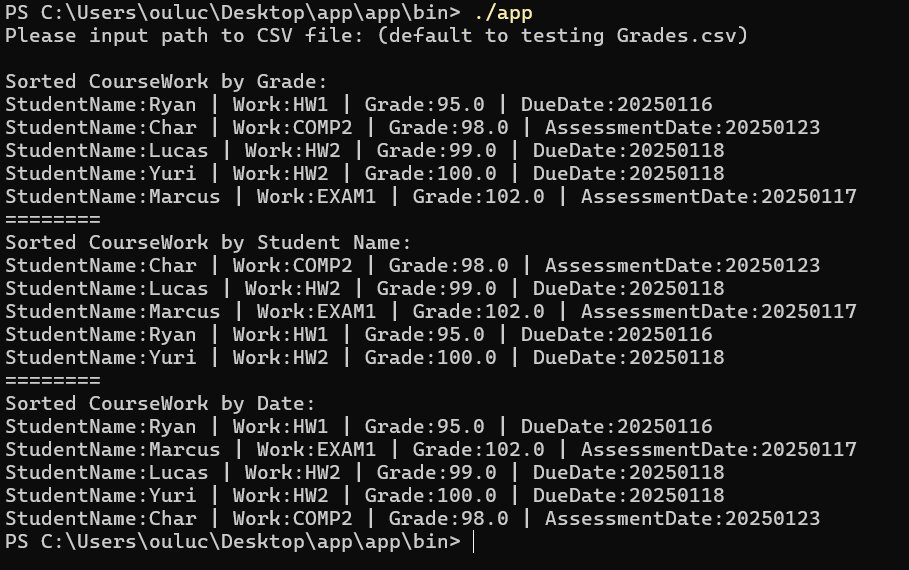

# GradeSystem
GradeSystem is a Java application to help teachers to view and sort student coursework data efficiently. This project intends to demonstrate several skills needed for the College Board AP CS A exam as of 2025.

## Getting Started

### Cloning the repository
> Exceptionally you can download this project as a zip and unzip.

Do the following: 
```bash
git clone https://github.com/lucas01b0x/GradeSystem.git
```

### Building the application
In the root directory of the project,
```bash
./gradlew build
```

### Option 1: Running the application with Gradle
In the root directory of the project,
```bash
./gradlew run
```
You should see the following after running.

Input the path for your CSV file location as shown below.

Otherwise, the application will default to a prewritten testing CSV file.


### Option 2: Running the application using app.zip
* After successfully running `./gradlew build` you should see app.zip in `GradeSystem\app\build\distributions\app.zip`
* Copy the `app.zip` file into your preferred directory.
* Unzip the `app.zip` file.
* Go to `app\bin` directory in terminal.
* Run `./app`.

You should see the following after running.

Input the path for your CSV file when prompted to.

Otherwise, the application will default to a prewritten testing CSV file, as show below.

